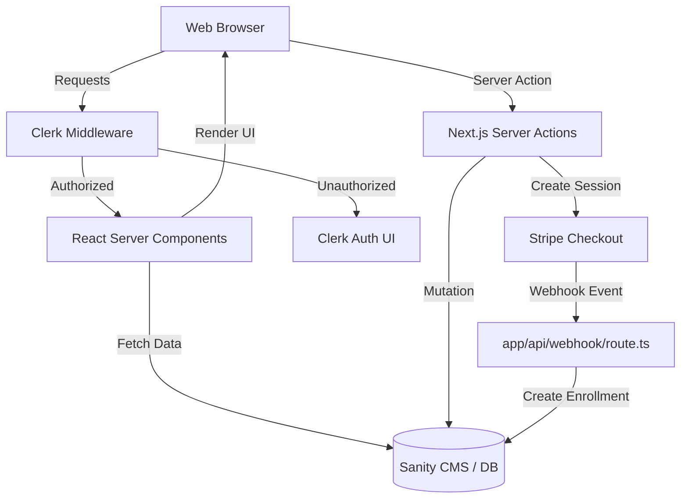
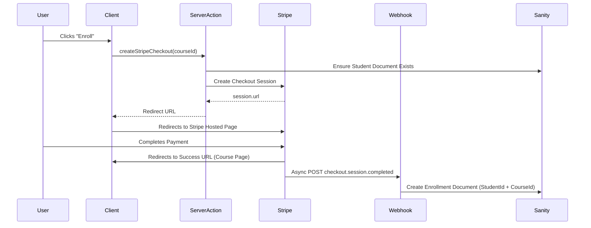

# System Architecture

This document details the macro-level architecture of the LMS platform, defining how requests, data, and authentication flow through the Next.js App Router and external systems.

## Overall Architecture

The LMS uses a Serverless Edge Architecture built on Next.js.

- **Frontend Tier**: React Server Components (RSC) and Client Components.
- **Backend Tier**: Next.js API Routes and Server Actions running on Node.js Serverless Functions.
- **Content & Database Tier**: Sanity CMS (Headless Content API + Document Store).
- **Identity Tier**: Clerk (JWT-based Edge authentication).
- **Financial Tier**: Stripe (Checkout and Webhook lifecycle).

## Request Lifecycle & Middleware

Every incoming request first hits `middleware.ts`.

1. **Edge Interception:** `clerkMiddleware` evaluates the requested route.
2. **Public Routes:** Routes matching `isPublicRoute` (like the homepage, `/courses/[slug]`, and `/api/stripe-checkout/webhook`) bypass authentication checks and hit the Next.js router directly.
3. **Protected Routes:** Routes matching `/dashboard(.*)` trigger an authentication check.
   - If the user has a valid Clerk session token, the request proceeds.
   - If unauthenticated, the user is redirected to the Clerk Sign-In page.

## Authentication Flow

Authentication is fully delegated to Clerk, minimizing security overhead on the application server.

1. User clicks "Sign In" and is routed to Clerk.
2. Clerk handles OAuth (Google/GitHub) or Magic Link authentication.
3. Clerk redirects the user back to the LMS.
4. `middleware.ts` verifies the session cookie on subsequent requests.
5. In Server Components, the application retrieves the user ID using `const { userId } = await auth();` from `@clerk/nextjs/server`.

## Data Flow: Sanity Integration

Sanity acts as both the Content Management System and the primary Database.

We use `next-sanity` with the new `defineLive` configuration for optimized data fetching.

### Read Flow (Content Delivery)
1. Server Components execute GROQ queries via `sanityFetch` (defined in `sanity/lib/live.ts`).
2. `sanityFetch` uses `SANITY_API_TOKEN` to read data.
3. If Draft Mode is enabled (`/api/draft-mode/enable`), Sanity responds with unpublished draft content. If disabled, it returns published content.
4. On the client side, the `<SanityLive />` component listens for real-time mutation events from Sanity Studio and automatically invalidates the Next.js Router cache, providing an instant Live Preview experience for authors.

### Write Flow (Mutations)
Write operations occur via Server Actions or Webhooks, utilizing `SANITY_API_ADMIN_TOKEN` which has elevated write permissions.

## Payment & Enrollment Flow

The system uses Stripe Checkout to process payments and Stripe Webhooks to asynchronously grant access to courses.

1. **Initiation**: The user triggers `createStripeCheckout` from the frontend.
2. **Checkout Creation**: The Server Action creates a Stripe Session, embedding `courseId` and `userId` into the session `metadata`.
3. **Payment**: The user pays on Stripe.
4. **Fulfillment (Webhook)**: Stripe sends a POST request to `/api/stripe-checkout/webhook`.
5. **Verification**: The webhook explicitly verifies the request signature using `STRIPE_WEBHOOK_SECRET`.
6. **Provisioning**: The webhook reads the `metadata` and uses the Admin Sanity Token to create an `Enrollment` document in the database.

## Course & Lesson Flow

Content delivery is guarded by authorization checks at the component level.

### Authorization Gate
When a user navigates to `/dashboard/courses/[courseId]`:
1. The Server Component retrieves the active `userId` from Clerk.
2. It executes a GROQ query to Sanity: *Does an Enrollment exist for this User ID and this Course ID?*
3. If `false`, the user is redirected to the `/my-courses` dashboard.
4. If `true`, the UI renders the course modules and lessons.

### Video Flow
Videos are NOT hosted internally. The CMS stores URLs (YouTube, Vimeo, etc.).
1. The client-side `<VideoPlayer />` component receives the URL.
2. `react-player` handles the iframe embedding and playback controls.
3. A strict `useEffect` hook ensures the player only mounts *after* React hydration to prevent server/client rendering mismatches.

## Server Actions

Server Actions are located in the `actions/` directory. They act as secure RPC (Remote Procedure Call) endpoints.

Why Server Actions over API Routes?
- **Type Safety**: End-to-end TypeScript safety from client to server.
- **Less Boilerplate**: No need to write `fetch` wrappers or manage HTTP status codes manually.
- **Security**: The source code is executed entirely on the server; API keys are never leaked to the client bundle.
